# Very Good Blog App - Blog sharing

[](https://flutter.dev/)

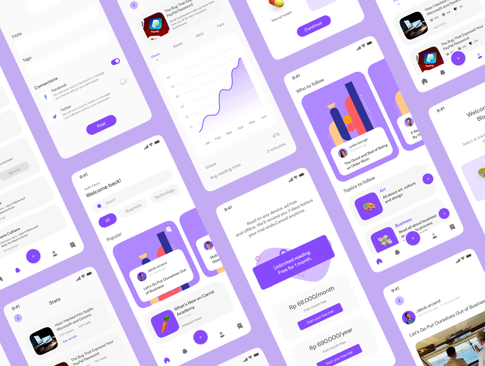

## Features

- Login, register, manage personal information.
- Compose, edit, post blog to share with everyone.
- Like, save blogs on the read list so that you can read them Offline if needed.

## Technology used

- Flutter & Dart
- Firebase Storage
- Django

## Flutter app used

- flutter_bloc for state management
- Boring layered architecture recommended by VeryGoodVentures
- Navigator 2.0 using go_router
- Service Locator using get_it
- Image repository using Firebase Storage

## Setup and run

<details>
    <summary>Click to expand</summary>
    <br>

- Setup and run
  - Flutter
    - Install [Flutter](https://flutter.dev/docs/get-started/install).
    - Using **`stable`** channel:
      ```bash
      ❯ flutter channel stable
      ❯ flutter upgrade
      ```
    - Flutter doctor:
      ```bash
      ❯ flutter doctor
      ```
    - Install all the packages by:
      ```bash
      ❯ flutter pub get
      ```
    - Run app on real devices or emulator by:
      ```bash
      ❯ flutter run
      ```
      or debug mode in VSCode or some IDEs

</details>

## Screenshots

|                                       |                                        |                                         |
| :-----------------------------------: | :------------------------------------: | :-------------------------------------: |
|             Splash Screen             |                Sign In                 |               Home Screen               |
|  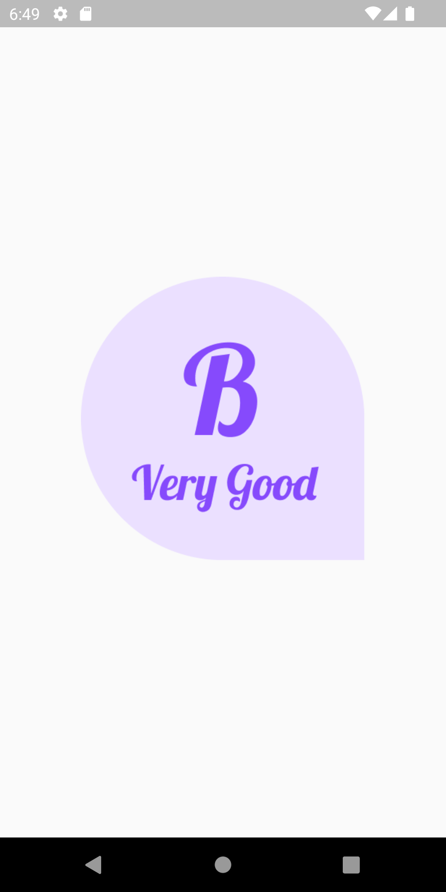  |   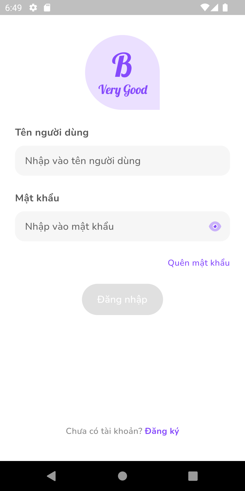   |  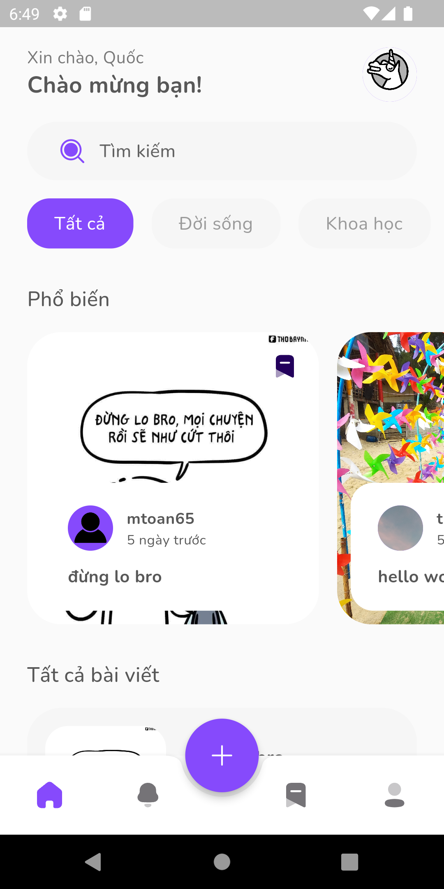  |
|               Bookmark                |              Blog Editor               |                 Submit                  |
| 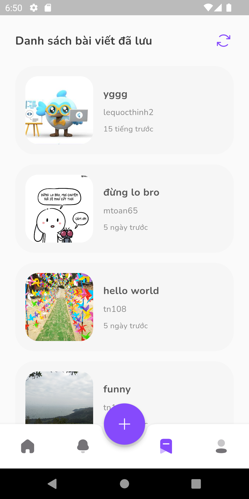 |  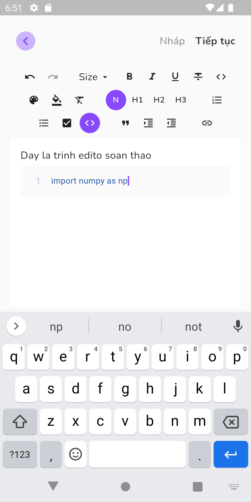   | 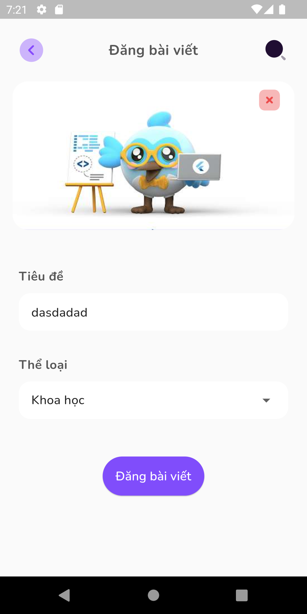 |
|               Blog View               |                Profile                 |           Profile Liked Blog            |
|   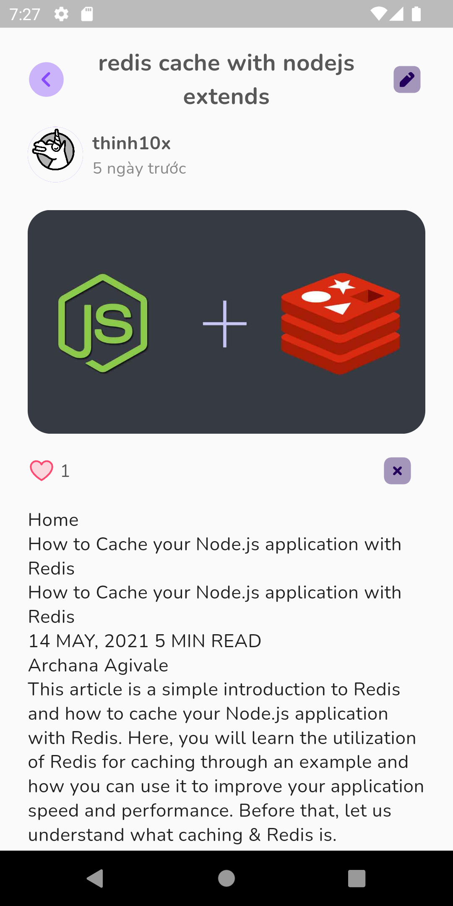   |  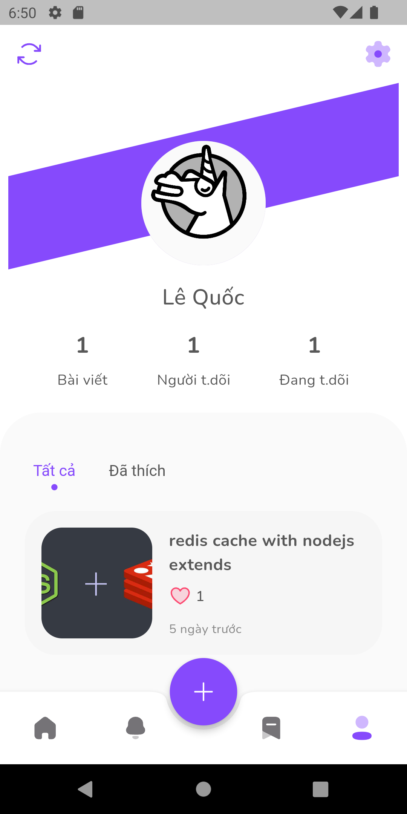  | 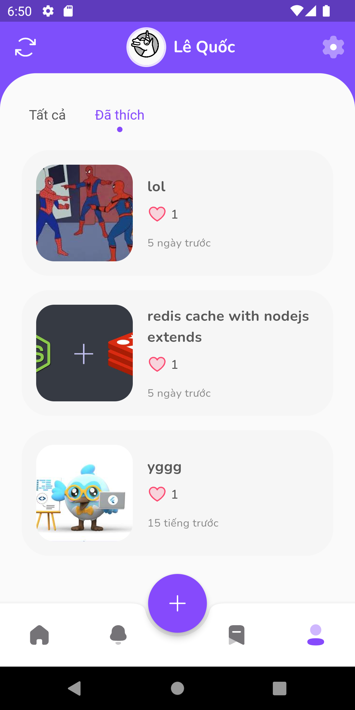 |
|                Setting                |              Edit Profile              |                                         |
| 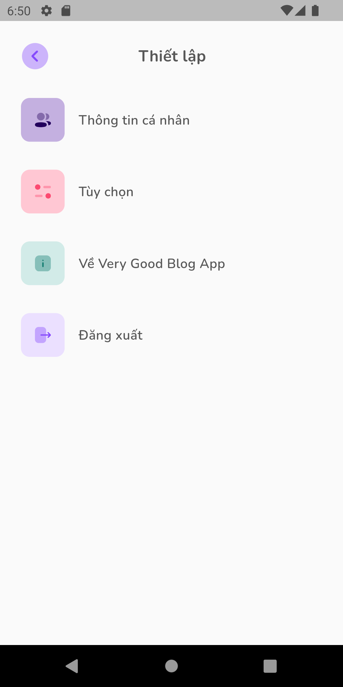  | 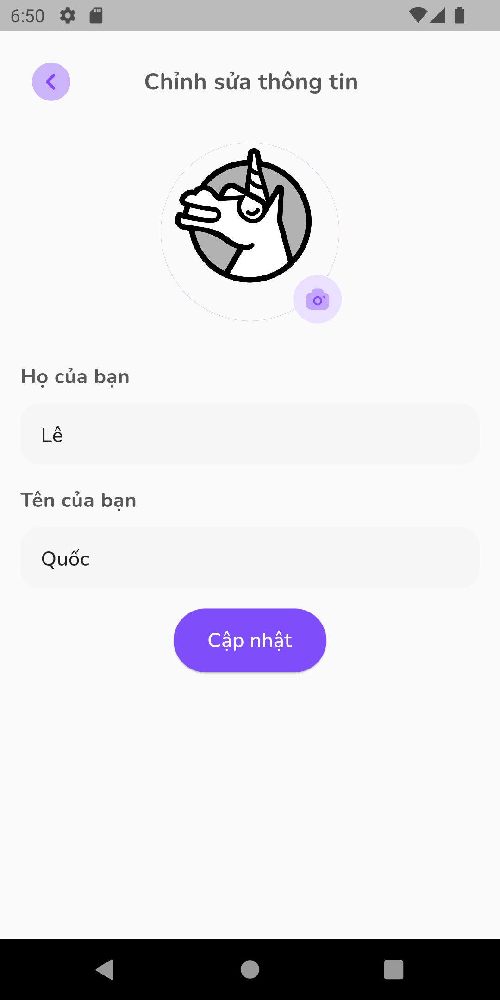 |                                         |

## Todo

- FCM to push notifications.

## Contributors✨

<!-- ALL-CONTRIBUTORS-LIST:START - Do not remove or modify this section -->
<!-- prettier-ignore-start -->
<!-- markdownlint-disable -->
<table>
  <tr>
    <td align="center"><br /><sub><b>Nguyen Minh Dung</b></sub></a><br /><a href="https://github.com/dungngminh/very_good_blog_app/commits?author=dungngminh" title="Code">💻</a> <a title="Mobile">📱</a> <a href="https://github.com/dungngminh/very_good_blog_app/commits?author=dungngminh" >
    <td align="center"><br /><sub><b>Le Quoc Thinh</b></sub></a><br /><a href="https://github.com/dungngminh/very_good_blog_app/commits?author=beobiebom" title="Code">💻</a> <a title="Mobile">📱</a> <a href="https://github.com/dungngminh/very_good_blog_app/commits?author=beobiebom" >
    <td align="center"><br /><sub><b>Tran Thanh Nhat</b></sub></a><br /><a href="https://github.com/dungngminh/very_good_blog_app/commits?author=H2Q318" title="Code">💻</a><a title="Backend">🔗</a> <a href="https://github.com/dungngminh/very_good_blog_app/commits?author=H2Q318" >
    <td align="center"><br /><sub><b>Dinh Minh Toan</b></sub></a><br /><a href="https://github.com/dungngminh/very_good_blog_app/commits?author=dtrbinh" title="Code">💻</a><a title="Mobile">📱</a> <a href="https://github.com/dungngminh/very_good_blog_app/commits?author=dtrbinh" >
  </tr>
  
</table>

<!-- markdownlint-restore -->
<!-- prettier-ignore-end -->

<!-- ALL-CONTRIBUTORS-LIST:END -->
